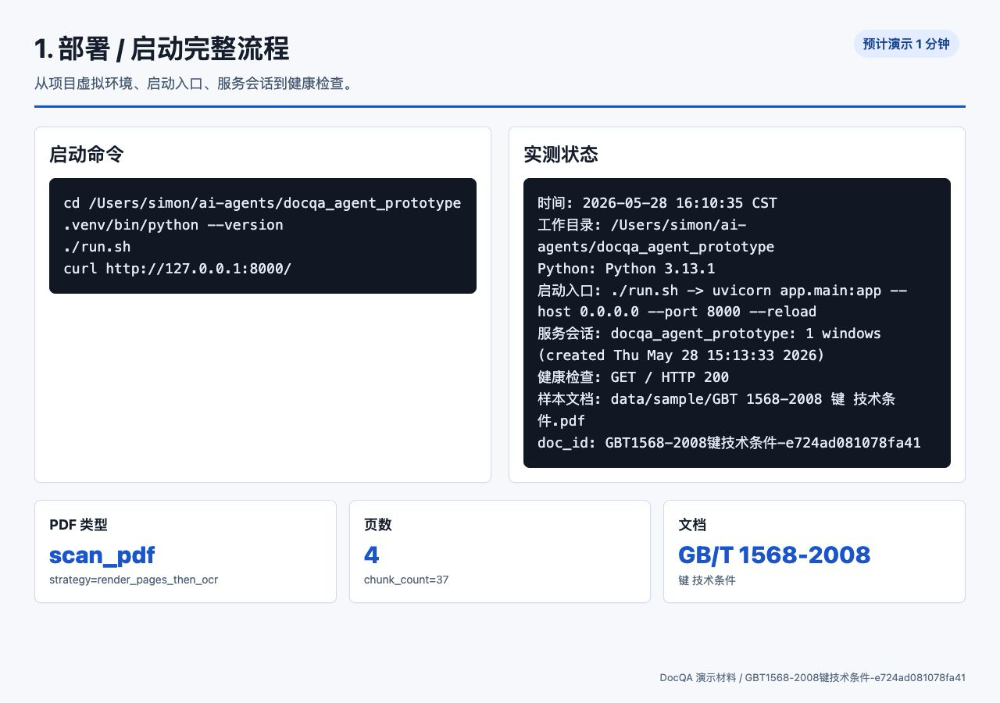
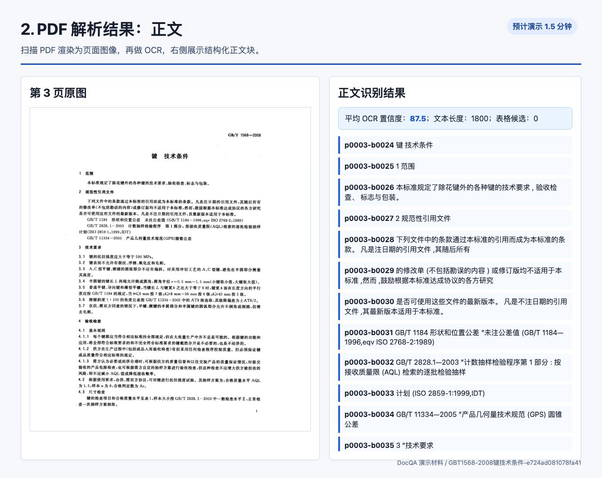
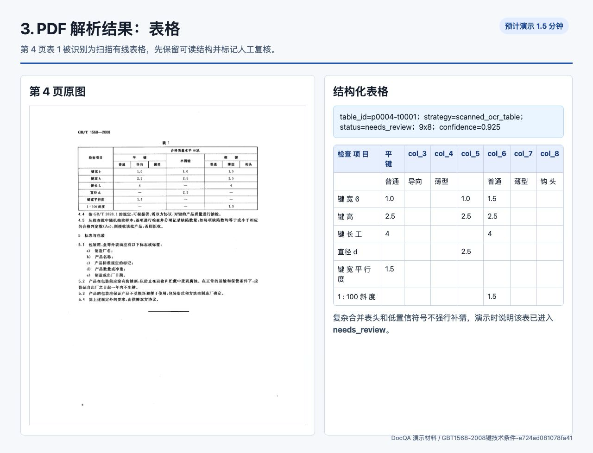
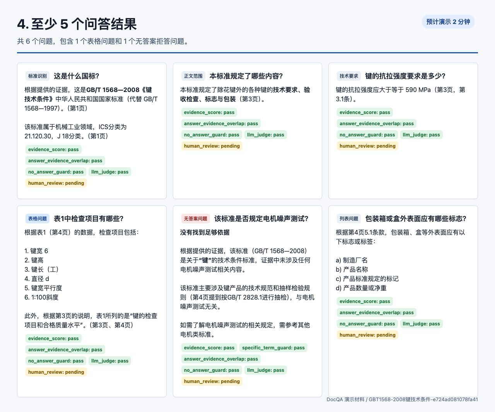
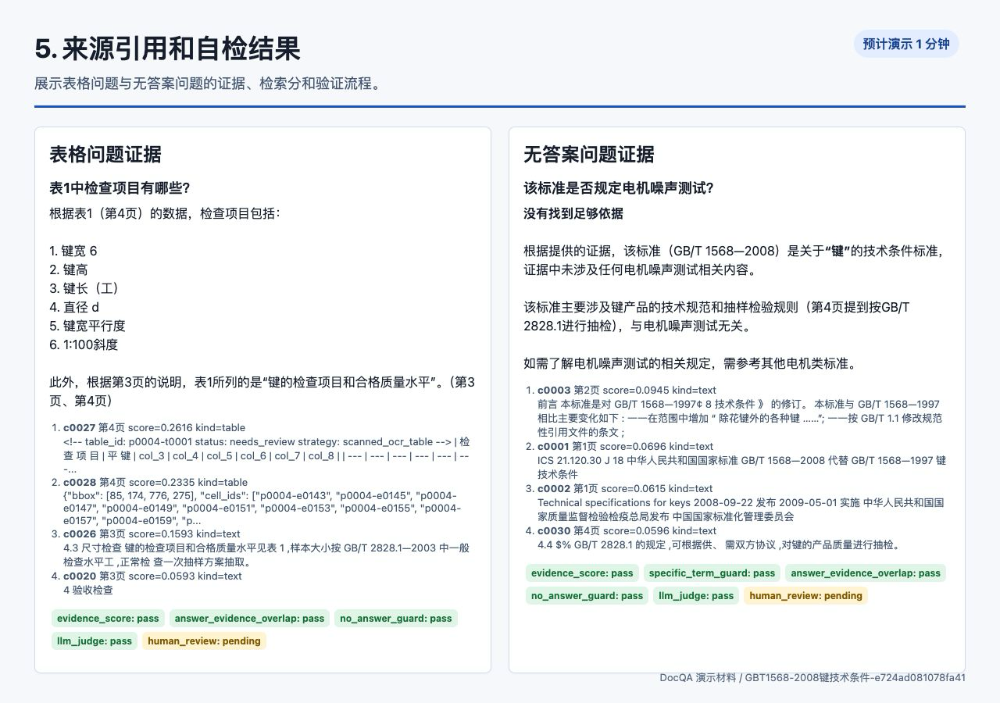
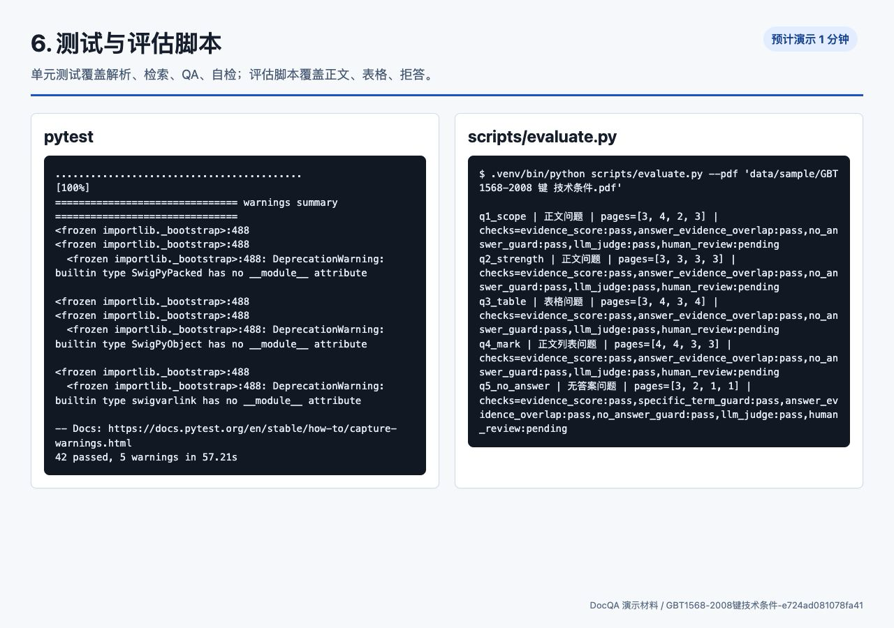

# 5-10 分钟演示材料

样本文档：`data/sample/GBT 1568-2008 键 技术条件.pdf`

目标文档：`GBT1568-2008键技术条件-e724ad081078fa41`

## 演示顺序

总时长建议控制在 7-8 分钟。

1. 部署 / 启动完整流程，约 1 分钟。
   

2. PDF 解析正文结果，约 1.5 分钟。
   

3. PDF 解析表格结果，约 1.5 分钟。
   

4. 6 个问答结果，约 2 分钟。
   

5. 来源引用和自检结果，约 1 分钟。
   

6. 测试与评估脚本结果，约 1 分钟。
   

## 问答覆盖

- `这是什么国标？`
- `本标准规定了哪些内容？`
- `键的抗拉强度要求是多少？`
- `表1中检查项目有哪些？`，表格问题。
- `该标准是否规定电机噪声测试？`，无答案拒答问题。
- `包装箱或盒外表面应有哪些标志？`

## 验证结果

```text
.venv/bin/pytest -q
42 passed, 5 warnings in 57.21s

.venv/bin/python scripts/evaluate.py --pdf 'data/sample/GBT 1568-2008 键 技术条件.pdf'
q1_scope      正文问题      pass
q2_strength   正文问题      pass
q3_table      表格问题      pass
q4_mark       正文列表问题  pass
q5_no_answer  无答案问题    pass
```

原始输出保存在：

- `docs/demo_assets/pytest_output.txt`
- `docs/demo_assets/evaluate_output.json`
- `docs/demo_assets/qa/*.json`
- `docs/demo_assets/demo_summary.json`
